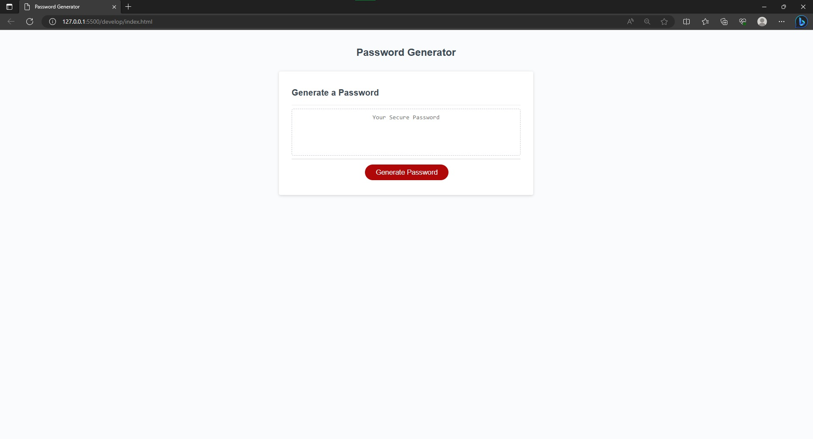

# Password Generator

## The application in reference to this README is a web application with code that was initially provided. It was not performing the intended function. I had to take this code and modify it so that it would provide a box in the page with a password generator. The user presses this button and is provided with a prompt asking the user to input a password length between 8-28 chracters. Following is a series of prompts asking what the user would like to include in their password.

## To use this application, press the "generate password" button. You will be given a prompt. Enter the length you would like your password to be and select "ok." After this, prompts providing you the option to choose between uppercase and lowercase letters, numbers, and special characters to include in the random password. Once this is complete, a random password will be generated and will populate in the box on the web application.

## To access this application, you can click the link provided(https://conquerershaki.github.io/challenge-week-03/) or gain access to it through github.

## Through my research, I found a lot of useful bits here and there. Some from StackOverflow, W3Schools, and geeksforgeeks as well.

 

Copyright 2023 ConquerersHaki Permission is hereby granted, free of charge, to any person obtaining a copy of this software and associated documentation files (the “Software”), to deal in the Software without restriction, including without limitation the rights to use, copy, modify, merge, publish, distribute, sublicense, and/or sell copies of the Software, and to permitpersons to whom the Software is furnished to do so, subject to the following conditions:The above copyright notice and this permission notice shall be included in all copies or substantial portions of the Software.THE SOFTWARE IS PROVIDED “AS IS”, WITHOUT WARRANTY OFANY KIND, EXPRESS OR IMPLIED, INCLUDING BUT NOT LIMITEDTO THE WARRANTIES OF MERCHANTABILITY, FITNESS FOR A PARTICULAR PURPOSE AND NONINFRINGEMENT. IN NO EVENTSHALL THE AUTHORS OR COPYRIGHT HOLDERS BE LIABLE FOR ANY CLAIM, DAMAGES OR OTHER LIABILITY, WHETHER IN AN ACTION OF CONTRACT, TORT OR OTHERWISE, ARISING FROM, OUT OF OR IN CONNECTION WITH THE SOFTWARE OR THE USE OR OTHER DEALINGS IN THE SOFTWARE.
